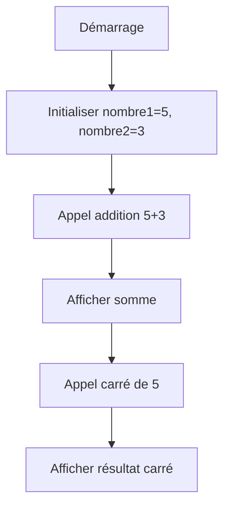

<think>
Nous avons un code Python simple avec deux fonctions et un programme principal.
 Objectif : Générer une documentation claire et détaillée en markdown.

 Structure proposée :
 1. Titre
 2. Description générale
 3. Fonctions :
    - Pour chaque fonction : nom, description, paramètres, retour, exemple d'utilisation (si pertinent)
 4. Programme principal : explication du flux

 Note : Le code contient une petite faute de frappe "foonction" -> nous allons l'ignorer dans la doc car c'est un commentaire.

 Rédigeons la documentation.
</think>

# Documentation du Programme Python : Calculs Mathématiques de Base

## 📌 Vue d'ensemble
Ce programme Python démontre des opérations mathématiques fondamentales à travers deux fonctions principales :
1. **Addition** de deux nombres
2. **Calcul du carré** d'un nombre

Le programme principal illustre l'utilisation de ces fonctions avec des valeurs d'exemple.

## 🧩 Fonctions

### 1. Fonction `addition(a, b)`
**Description**  
Calcule la somme de deux nombres fournis en entrée.

**Paramètres**
| Nom | Type | Description |
|-----|------|-------------|
| `a` | int/float | Premier opérande |
| `b` | int/float | Second opérande |

**Valeur de retour**  
- Type: `int` ou `float`  
- Description: Résultat de l'opération `a + b`

**Exemple d'utilisation**  
```python
resultat = addition(5, 3)
print(resultat)  # Output: 8
```

---

### 2. Fonction `carre(x)`
**Description**  
Calcule le carré d'un nombre (multiplication du nombre par lui-même).

**Paramètres**
| Nom | Type | Description |
|-----|------|-------------|
| `x` | int/float | Nombre à élever au carré |

**Valeur de retour**  
- Type: `int` ou `float`  
- Description: Résultat de `x * x`

**Exemple d'utilisation**  
```python
resultat = carre(4)
print(resultat)  # Output: 16
```

---

## ⚙️ Programme Principal
Le bloc `if __name__ == "__main__":` contient le code exécuté lorsque le script est lancé directement.

**Séquence d'opérations :**
1. Initialisation de deux variables :
   ```python
   nombre1 = 5
   nombre2 = 3
   ```
2. Appel et affichage de la somme :
   ```python
   print("La somme est :", addition(nombre1, nombre2))
   # Output: La somme est : 8
   ```
3. Appel et affichage du carré de `nombre1` :
   ```python
   print("Le carré de", nombre1, "est :", carre(nombre1))
   # Output: Le carré de 5 est : 25
   ```

**Flux d'exécution :**


## 💻 Exemple de Sortie
Lorsque le programme est exécuté, la sortie suivante est générée :
```
La somme est : 8
Le carré de 5 est : 25
```

## 🚀 Utilisation Avancée
Pour étendre ce programme :
1. Ajouter une fonction de multiplication :
   ```python
   def multiplication(a, b):
       return a * b
   ```
2. Implémenter une interface utilisateur avec `input()` :
   ```python
   x = float(input("Entrez un nombre : "))
   print("Son carré est :", carre(x))
   ```
3. Ajouter une gestion d'erreurs avec `try/except` pour les entrées non numériques.

> **Note** : Ce programme sert de base pédagogique pour illustrer la création et l'utilisation de fonctions en Python.