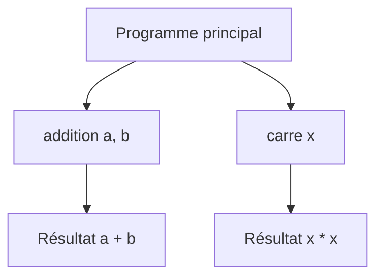

<think>
Nous allons générer une documentation claire et structurée en Markdown pour ce code.
 Le code contient deux fonctions : `addition` et `carre`, ainsi qu'un programme principal qui les utilise.

 Structure de la documentation :
 1. Titre
 2. Description du programme
 3. Table des matières (optionnel, mais utile pour la clarté)
 4. Description des fonctions avec leurs paramètres et ce qu'elles retournent
 5. Description du programme principal
 6. Exemple d'utilisation

 Nous allons utiliser un style moderne, avec des sections bien définies et éventuellement des blocs de code pour les exemples.
</think>

# Documentation du Programme Python : Calculs Mathématiques de Base

## 📌 Vue d'ensemble
Ce programme Python démontre des opérations mathématiques fondamentales à travers deux fonctions principales :
1. **Addition** de deux nombres
2. **Calcul du carré** d'un nombre

Le programme principal illustre l'utilisation de ces fonctions avec des valeurs d'exemple.



## 🔍 Fonctions

### ➕ `addition(a, b)`
Calcule la somme de deux nombres.

**Paramètres :**
| Nom | Type | Description          |
|-----|------|----------------------|
| `a` | int/float | Premier opérande  |
| `b` | int/float | Deuxième opérande |

**Retourne :**  
`int` ou `float` - Résultat de l'opération `a + b`

**Exemple d'utilisation :**
```python
resultat = addition(5, 3)
print(resultat)  # Output: 8
```

### 🔲 `carre(x)`
Calcule le carré d'un nombre (x²).

**Paramètres :**
| Nom | Type | Description        |
|-----|------|--------------------|
| `x` | int/float | Nombre à élever au carré |

**Retourne :**  
`int` ou `float` - Résultat de l'opération `x * x`

**Exemple d'utilisation :**
```python
resultat = carre(4)
print(resultat)  # Output: 16
```

## 🚀 Programme Principal
Le bloc `if __name__ == "__main__":` sert de point d'entrée lors de l'exécution directe du script.

**Séquence d'exécution :**
1. Initialisation de deux variables :
   ```python
   nombre1 = 5
   nombre2 = 3
   ```
2. Appel et affichage de l'addition :
   ```python
   print("La somme est :", addition(nombre1, nombre2))
   ```
3. Appel et affichage du carré :
   ```python
   print("Le carré de", nombre1, "est :", carre(nombre1))
   ```

**Sortie attendue :**
```
La somme est : 8
Le carré de 5 est : 25
```

## 💻 Comment exécuter
1. Sauvegardez le code dans un fichier `.py` (ex: `calculs.py`)
2. Exécutez-le via la ligne de commande :
```bash
python calculs.py
```

## 🔄 Extensibilité
Ce programme peut être facilement étendu pour :
- Prendre des entrées utilisateur avec `input()`
- Ajouter d'autres opérations mathématiques
- Intégrer des vérifications d'erreurs
```python
# Exemple d'extension avec saisie utilisateur
if __name__ == "__main__":
    a = float(input("Entrez le premier nombre: "))
    b = float(input("Entrez le deuxième nombre: "))
    print("La somme est :", addition(a, b))
    print("Le carré de", a, "est :", carre(a))
```