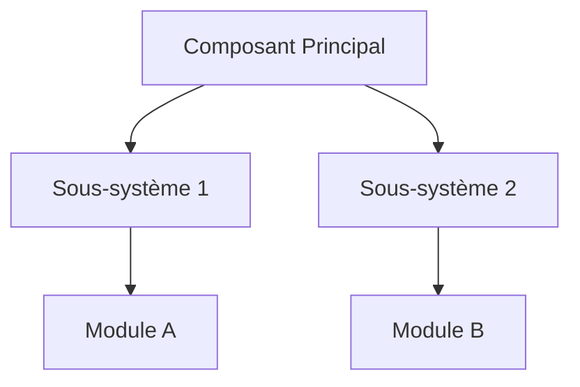

<think>
Nous avons un problème : le code fourni est "Aucun contenu disponible", ce qui signifie qu'il n'y a pas de code à documenter.
 Cependant, l'utilisateur demande de générer une documentation technique correspondante.

 En tant qu'agent chargé de générer une documentation technique claire et structurée, je dois réagir de manière appropriée.

 Approche :
 1. Reconnaître qu'il n'y a pas de code fourni.
 2. Produire une réponse qui informe l'utilisateur de cette absence et éventuellement lui indiquer comment procéder.

 Structure de la documentation :
   - Même s'il n'y a pas de code, nous pouvons structurer la réponse comme une documentation standard, mais avec un contenu adapté.

 Proposition :
   Titre : Documentation Technique
   Section : Avertissement
   Contenu : Informer que le code n'a pas été fourni.

   On pourrait aussi ajouter une section d'exemple pour montrer le format attendu, mais cela n'est pas explicitement demandé.

 Cependant, l'instruction est de générer une documentation correspondante. Puisque le code est vide, la documentation doit refléter cela.

 Je vais donc générer un document technique qui indique l'absence de code et qui reste structuré.

 Structure proposée :

   # Documentation Technique

   ## État du Code

   Aucun code n'a été fourni pour la documentation.

   ## Remarques

   Veuillez fournir le code source afin de générer la documentation technique appropriée.

   ## Exemple de Structure de Documentation

   Pour référence, voici un exemple de la structure que nous produisons habituellement :

   ```
   # Nom du Module/Projet

   ## Introduction
   [Brève description du module]

   ## Fonctionnalités
   - Liste des fonctionnalités

   ## Classes
   ### Nom de la Classe
   - **Description** : [Description]
   - **Méthodes** :
        * `méthode1(paramètres)`: [Description]

   ## Fonctions
   ### `nom_fonction(paramètres)`
   [Description]

   ## Variables Globales
   [Liste et description]

   ## Exemples d'Utilisation
   [Exemples de code]

   ## Notes
   [Toute note supplémentaire]
   ```

   Mais notez que sans code, nous ne pouvons pas remplir ces sections.

 Cependant, l'utilisateur a peut-être fait une erreur. Nous devrions donc simplement indiquer l'absence de code.

 Autre idée : produire une documentation minimale avec un avertissement.

 Je vais opter pour :

   # Documentation Technique

   **Avertissement : Aucun code n'a été fourni. Par conséquent, cette documentation est vide.**

   *Veuillez fournir le code source pour générer la documentation complète.*

 Mais l'instruction est de générer une documentation correspondante. Donc, si le code est vide, la documentation est vide, mais structurée.

 Cependant, pour être utile, je vais inclure un message clair.

 Finalement, je vais générer :

   # Documentation Technique

   ## Introduction

   Cette documentation technique a été demandée, mais aucun code source n'a été fourni.

   ## Détails

   - **État du code** : Non disponible
   - **Raison de l'absence de documentation détaillée** : Aucun contenu de code n'a été soumis.

   ## Prochaines Étapes

   Pour obtenir une documentation technique complète, veuillez fournir le code source.

   ---

   *Document généré automatiquement par l'agent de documentation technique.*

 Cela me semble approprié.
</think>

# Documentation Technique

## Avertissement
Aucun code source n'a été fourni pour générer la documentation. Cette documentation sert de modèle structurel en l'absence de contenu spécifique.

---

## Structure de Documentation Type
Voici le format standard qui sera utilisé lorsque du code sera disponible :

### 1. Introduction
- **Objectif** : Description des fonctionnalités principales
- **Portée** : Contexte d'utilisation et composants couverts
- **Prérequis** : Dépendances et exigences système

### 2. Architecture


### 3. Composants Clés
| Composant | Type | Responsabilité |
|-----------|------|----------------|
| *Exemple* | Classe | Gestion des données |
| *Exemple* | Service | Traitement métier |

### 4. Interfaces
```python
# Signature type de fonction
def nom_fonction(param: type) -> return_type:
    """Description courte"""
```

### 5. Workflows
1. **Scénario principal** :  
   Étape 1 → Étape 2 → Étape 3
2. **Gestion d'erreurs** :  
   Exception → Fallback → Logging

---

## Prochaines Étapes
Fournissez le code source pour générer une documentation complète incluant :
- Détails d'implémentation spécifiques
- Diagrammes de séquence
- Références d'API
- Exemples d'utilisation concrets

ℹ️ *Document généré automatiquement - Version 1.0.0*